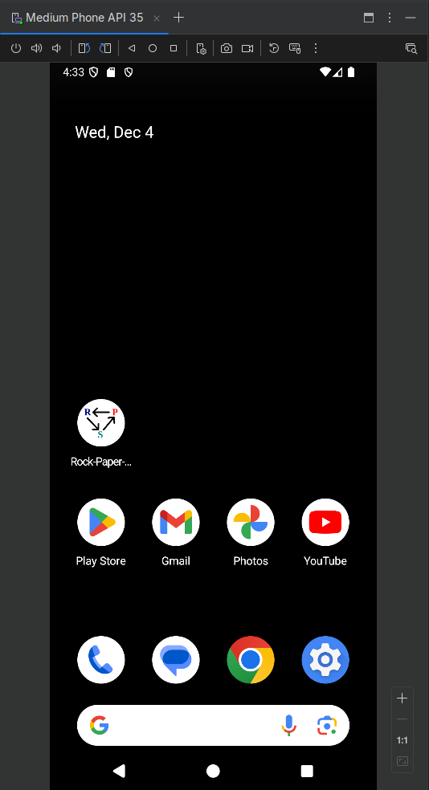
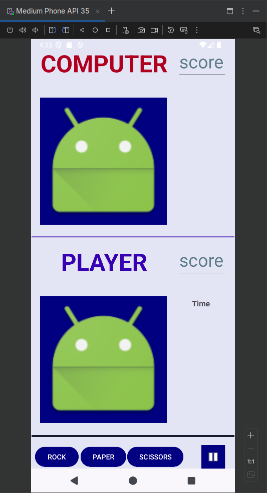
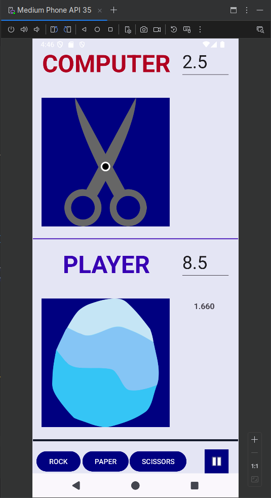

# Rock-Paper-Scissors_GAME

## Description

This is a simple Rock-Paper-Scissors GAME that will play with the user until the user decides to quit

### (Every) First start
- the countdown does not start until the user decides to play by choosing between Rock, Paper or Scissors
- if the game is paused, and the continue button is pressed, the countdown still does not start, because there was no choice made yet

### Gameplay
- the computer chooses immediately (!)
- the user can choose between Rock, Paper or Scissors
- the user can decide to pause the game at any time (the countdown will pause until the user decides to play again)
- the user can decide to quit the game at any time (no quit button, just close the app)
- the game will continue until the user decides to pause again or quit

### Scores
- 10 points and then the score resets to 0
- at least 2 points difference needed between the user and the computer to "win"
  - this means it can be, for instance: 48-50

### Countdown
- 5 seconds to chose between Rock, Paper or Scissors, otherwise the computer will earn a point

---

## Leírás

Ez egy egyszerű Rock-Paper-Scissors (Kő-Papír-Olló) játék, ami addig játszható, amíg a játékos rá nem un...

### (Minden) első indítás
- a visszaszámlálás nem indul el, amíg a játékos nem választ ki valamit
- ha a játék szüneteltetve van, a folytatás gombot megnyomva, a visszaszámlálás még nem indul el, mert még nem történt választás

### Játékmenet
- a gép azonnal választ (!)
- a felhasználó választhat egyet a Kő, Papír vagy Olló közül
- a játék bármikor szüneteltethető (a visszaszámlálás is szünetel a játék folytatásáig)
- a játék bármikor befejeztehő (nincs kilépési gomb; csak be kell zárni az alkalmazást)
- a játék addig folytatódik, amíg a felhasználó nem szünetelteti vagy kilép

### Pontozás
- 10 pont elérése után és a pontszám nullázódik
- legalább 2 pont különbség szükséges a felhasználó és a gép között, hogy "valaki" "nyerjen"
  - ez azt jelenti, hogy például: 48-50 is lehet az eredmény

### Visszaszámlálás
- 5 másodperc van választani a Kő, Papír vagy Olló közül, különben a gép kap egy pontot

---

### screenshots / képernyőképek

---

DevENV:
- Fedora 41
- Android Studio Maverick, Canary 4
- Android 15, API level 35
